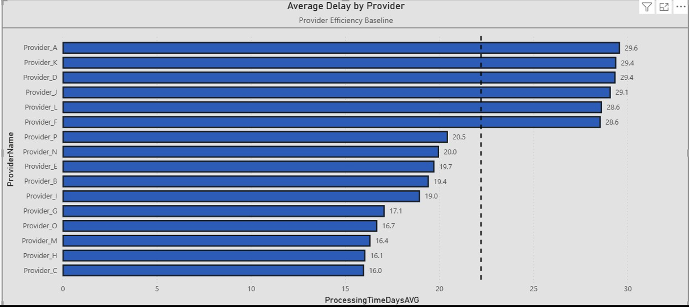
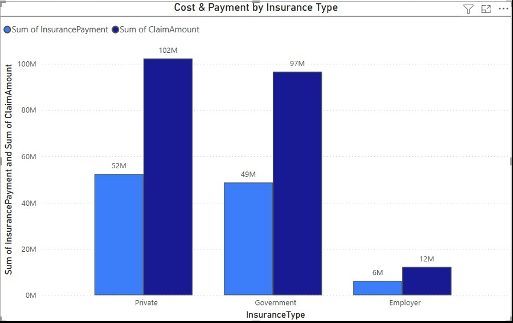
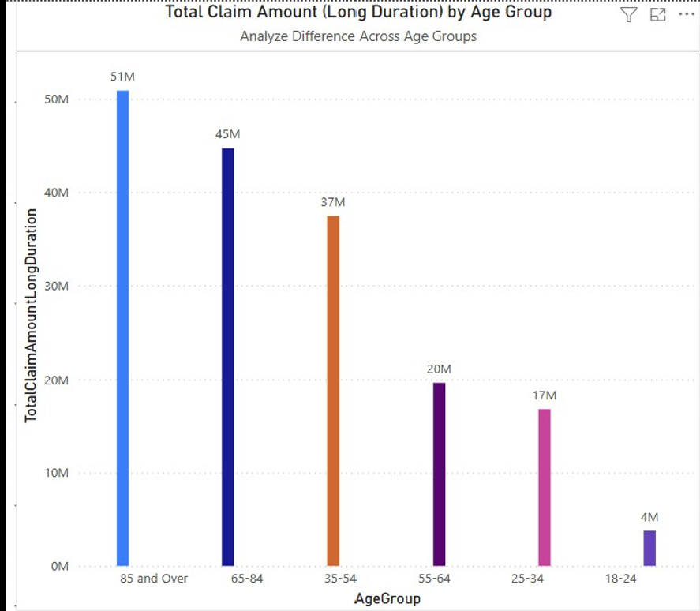
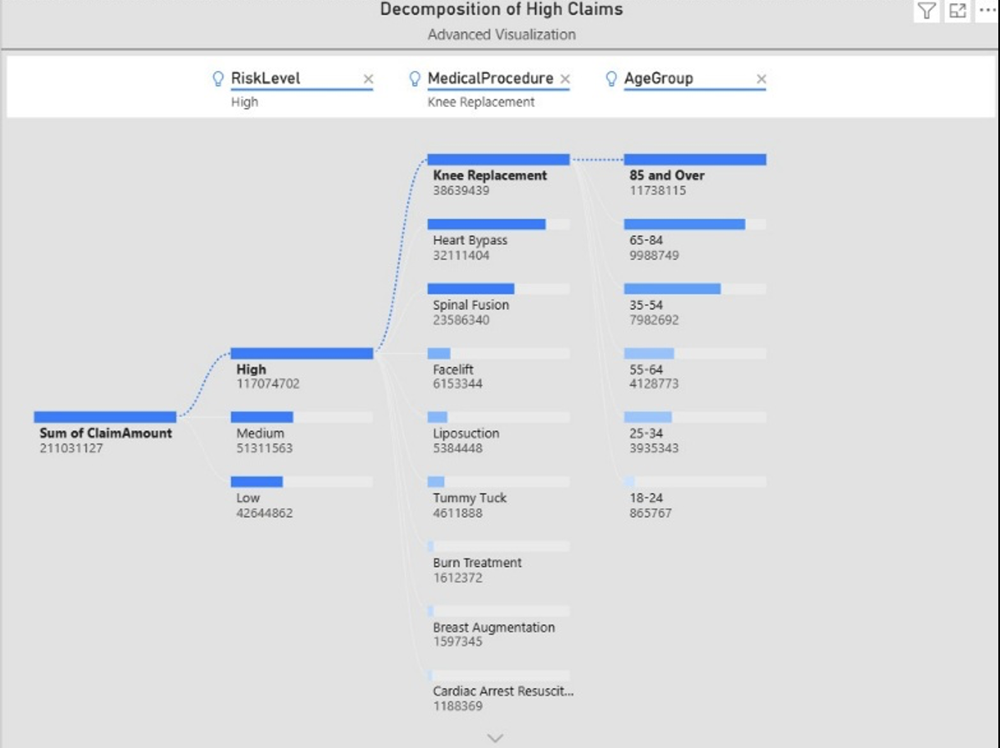

# Healthcare Claims & Operational Efficiency Analysis

## Overview
Analyzed healthcare insurance claims data to evaluate cost drivers, processing efficiency, and patient risk factors. The goal was to identify operational bottlenecks, understand financial impact across patient groups, and improve overall claims processing performance.

---

## Business Problem
Healthcare organizations must balance cost, efficiency, and patient outcomes. Delays in claims processing and high-cost procedures can negatively impact both operational performance and customer satisfaction.

---

## Tools & Technologies
- Power BI (Data Modeling, DAX, Visualization)

---

## Data Model
- Built a **star schema** with a central fact table (Claims) and supporting dimension tables:
  - Patient
  - Procedure
  - Provider
  - Date

This structure enabled efficient querying and scalable analysis across multiple dimensions.

---

## Key Insights

### 1. Claims Processing Efficiency Varies by Provider
- Processing time ranged from **~16 to ~30 days**
- Certain providers consistently underperform

Operational bottlenecks exist at the provider level

---

### 2. Fraud Detection Impacts Processing Time
- Claims with fraud detection programs had slightly longer processing times

Additional validation steps may increase delays but improve oversight

---

### 3. High-Cost Claims Are Concentrated in Specific Segments
- Older patients (65+) drive the highest claim costs
- Complex procedures (e.g., surgeries) contribute most to high claim amounts

Cost is driven by both **patient demographics + procedure complexity**

---

### 4. Insurance Plan Type Impacts Financial Burden
- Premium plans cover more of the claim cost
- Basic plans shift more cost to patients

Coverage structure directly affects patient financial responsibility

---

### 5. Procedure Risk and Duration Influence Outcomes
- Higher-risk and longer procedures show more variability in success rates

Operational planning must consider both cost and clinical risk

---

## 📈 Visualizations

### Claims Processing Analysis

### Cost & Claim Analysis

### Patient & Demographics Insights

### Cost Breakdown/Drivers

---

## Business Recommendations

- Optimize claims processing workflows for underperforming providers  
- Balance fraud detection with efficiency improvements  
- Focus cost management strategies on high-risk, high-cost patient segments  
- Enhance plan structures to improve cost transparency for patients  
- Use data-driven insights to improve operational decision-making  

---

## Business Impact
This analysis demonstrates how data can be used to:
- Improve claims processing efficiency  
- Identify cost drivers and financial risk  
- Optimize provider performance  
- Support better healthcare and financial decision-making  

---

## Project Takeaway
This project highlights my ability to design data models, build analytical dashboards, and use data to drive operational and financial improvements in complex systems.
